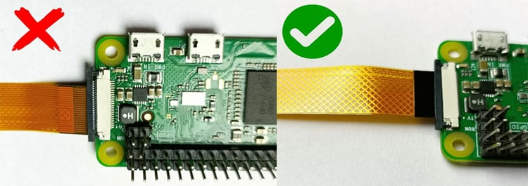

# Camera

## Wiring

Congratulations - you've reached the one component of this year's season that doesn't need any special wiring! Instead, there's a port on the side of your Pi that your camera module can connect to. For a simple overview of how to connect your camera, just watch this short video from Raspberry Pi:

<iframe width="100%" height="550" src="https://www.youtube-nocookie.com/embed/VzYGDq0D1mw" title="How to Use the Raspberry Pi Camera Module
" frameborder="0" allow="accelerometer; autoplay; clipboard-write; encrypted-media; gyroscope; picture-in-picture; web-share" referrerpolicy="strict-origin-when-cross-origin" allowfullscreen></iframe>

:::note
The video references the Ethernet port on the Raspberry Pi 5 as a reference for where the camera port is located. On the Pi Zero 2W, the Pi that you're using, it's located on the side, opposite to the MicroSD card:


:::

## Code

Unfortunately, the wiring is where the easy parts about this sensor end. Since the camera takes whole images and doesn't just transmit numbers like the other sensors, we have to modify our code to handle image data.

### How is an image sent?

Socket.IO, the library we use for communication, is great at sending text-based data. An image, however, is binary data (a complex collection of ones and zeros). To send it, we first need to convert it into a text-based format. The standard for this is **Base64 encoding**.

Think of Base64 as a special alphabet that can represent any binary data, including images, using only common text characters. Our plan is:

1. **Client:** A user clicks a "Take Picture" button on the webpage. This sends a `request_image` event to the server.
2. **Server (Pi):** When it receives `request_image`, it will:
    a.  Use the camera to capture an image.
    b.  Keep the image in memory instead of saving it to a file.
    c.  Encode the image into a Base64 text string.
    d.  Send this string back to the client in a `new_image` event.
3. **Client:** When it receives the `new_image` event, it will take the Base64 string and use it as the source for an `` tag, causing the new picture to appear on the page.

Let's get started!

### Server-Side Changes (`main.py`)

First, we need to add the libraries for controlling the camera and handling image data. The `picamera2` library is the modern standard for Raspberry Pi cameras and is included in the SDK. We'll also need `io` to handle the image in memory and `base64` to do the encoding.

Here is the complete `main.py` file with the camera logic added.

```python
# Everything here is unchanged...
from flask import Flask, render_template
from flask_socketio import SocketIO
import random
from bmp180 import BMP180

# Added for camera functionality
from picamera2 import Picamera2
import io
import base64

app = Flask(__name__)
socketio = SocketIO(app)
bmp = BMP180()

# --- Camera Setup ---
# Initialize the camera. We do this once when the server starts.
picam2 = Picamera2()
# Configure the camera for a small, fast preview image.
camera_config = picam2.create_preview_configuration(main={"size": (640, 480)})
picam2.configure(camera_config)
# Start the camera.
picam2.start()
# --- End Camera Setup ---

@app.route('/')
def index():
    return render_template('index.html')

def background_thread():
    while True:
        socketio.sleep(1)
        barometricPressure = bmp.get_pressure()
        socketio.emit(
            'update_data',
            {
                'randomNumber': random.randint(1, 100),
                'barometricPressure': barometricPressure
            }
        )

@socketio.on('connect')
def handle_connect():
    print('Client connected')
    socketio.start_background_task(target=background_thread)

@socketio.on('do_a_thing')
def do_a_thing(msg):
    print(msg['hello'])

# --- New Camera Event Handler ---
# This function is called when the client sends a 'request_image' event.
@socketio.on('request_image')
def handle_image_request():
    # Create an in-memory stream to hold the image data.
    stream = io.BytesIO()
    # Capture the image and save it to the stream in JPEG format.
    picam2.capture_file(stream, format='jpeg')
    # Rewind the stream to the beginning so we can read its content.
    stream.seek(0)
    
    # Read the binary data from the stream and encode it to a Base64 string.
    # We must decode it to a UTF-8 string to send it over Socket.IO.
    b64_image = base64.b64encode(stream.read()).decode('utf-8')
    
    # Emit a 'new_image' event to the client with the image data.
    socketio.emit('new_image', {'image_data': b64_image})
    print("Sent new image to client.")
# --- End New Camera Event Handler ---

def main():
    socketio.run(app, host='0.0.0.0', port=80, allow_unsafe_werkzeug=True)

if __name__ == '__main__':
    main()
```

### Client-Side Changes (`templates/index.html`)

Now, let's update our webpage. We need to add a button to request the image and an `` element to display it. Then, we'll add the JavaScript to handle the button click and receive the image data.

```html
<!DOCTYPE html>
<html>
<head>
    <title>Aerospace Jam Example</title>
    <script src="{{ url_for('static', filename='js/socket.io.js') }}"></script>
</head>
<body>
    <h1>Aerospace Jam Example</h1>
    <p><b>Random number chosen by the Pi: </b> <span id="randomNumber">Loading...</span></p>
    <p><b>Barometric Pressure: </b> <span id="barometricPressure">Loading...</span> hPa</p>
    <button id="doAThingButton">Click me to do a thing on the server!</button>
    <hr>
    <!-- Add a button to request an image and an image tag to display it -->
    <h2>Camera</h2>
    <button id="takePictureButton">Take Picture</button>
    <br>
    

    <script>
        document.addEventListener('DOMContentLoaded', function() {
            var socket = io.connect('http://' + document.domain + ':' + location.port);
            socket.on('update_data', function(msg) {
                var randomNumberSpan = document.getElementById('randomNumber');
                randomNumberSpan.textContent = msg.randomNumber;
                var barometricPressureSpan = document.getElementById('barometricPressure');
                barometricPressureSpan.textContent = msg.barometricPressure;
            });
            var doAThingButton = document.getElementById('doAThingButton');
            doAThingButton.addEventListener('click', function() {
                socket.emit('do_a_thing', { hello: 'Hello, Aerospace Jam! This is a message being sent from the client to the server.' });
            });

            // --- New Camera Javascript ---
            var takePictureButton = document.getElementById('takePictureButton');
            var cameraImage = document.getElementById('cameraImage');

            // 1. When the "Take Picture" button is clicked, send an event to the server.
            takePictureButton.addEventListener('click', function() {
                console.log('Requesting image from server...');
                socket.emit('request_image');
            });

            // 2. When we receive a 'new_image' event from the server...
            socket.on('new_image', function(msg) {
                console.log('Received new image!');
                // 3. Update the 'src' of our image tag.
                // We must add 'data:image/jpeg;base64,' before the image data
                // to tell the browser how to interpret the Base64 string.
                cameraImage.src = 'data:image/jpeg;base64,' + msg.image_data;
            });
            // --- End New Camera Javascript ---
        });
    </script>
</body>
</html>
```

### Testing It

Save both files, run `main.py` from Thonny, and open your Pi's web address in a browser. You should now see a "Take Picture" button. When you click it, the `` element below it should update with a live picture from your Pi's camera!

## Troubleshooting

If you click the button but no image appears, or the program crashes, here are a few things to check.

#### 1. Check the Physical Connection

The camera's ribbon cable is delicate and must be connected correctly.

- Is the cable inserted the right way around? The blue tab should face away from the Pi's circuit board. The metal contacts should face the board.
- Is the cable fully and squarely inserted into the connector?
- Is the black plastic latch on the connector firmly closed?
- Re-watch the connection video at the top of this guide to be sure.

#### 2. Check if the Pi Can See the Camera

The Raspberry Pi has a command-line tool to check the camera status.

1. Open a new Terminal in Thonny (`Tools > Open system shell`).
2. Run the command: `vcgencmd get_camera`
3. You should see output like `supported=1 detected=1`.
    - **If you see `supported=1 detected=1`:** The camera is connected and enabled correctly. The problem is likely in your Python or Javascript code.
    - **If you see `supported=1 detected=0`:** The camera interface is enabled, but the Pi can't physically detect the camera. This points to a hardware problem. Go back to step 1 and double-check the physical connection.
    - **If you see `supported=0`:** The camera interface is not enabled in the Pi's configuration. The SDK should handle this, but you can enable it manually by running `sudo raspi-config`, navigating to `Interface Options` > `Legacy Camera`, and selecting `Yes`. You will need to reboot after this change.

#### 3. Check the Code

- **Server (`main.py`):** Did you import all the necessary libraries (`picamera2`, `io`, `base64`)? Are there any typos in the `@socketio.on('request_image')` or `socketio.emit('new_image', ...)` lines? Check the Thonny shell for any error messages when you click the button.
- **Client (`index.html`):** Open your browser's developer console (usually by pressing F12) and look for errors. A common mistake is a typo in the event name (`socket.emit('request_image')` or `socket.on('new_image', ...)`). Another is forgetting to add `data:image/jpeg;base64,` to the `src` attribute of the image.

## Advanced: Streaming Video

This guide covers sending single, high-quality JPEG images on demand. But what if you want a live video feed?

Streaming video is much more complex because you need to send many frames per second. Sending a continuous stream of 640x480 JPEGs would quickly overwhelm your Wi-Fi connection. The solution is **video compression**.

Instead of sending individual pictures, you would capture a compressed video stream (like H.264) on the Pi and send that data to the client. The client would then need a special player to decode and display this stream in real-time.

While we won't provide a full code example, here is a high-level approach if you want to tackle this challenge (for bonus points, I might add!):

### Server-Side (The Broadcaster)

1. **Configure for Video:** Use `picamera2` to configure the camera for video capture, not still images. You'll want to set a resolution and framerate.
2. **Use a Custom Output:** The `picamera2` library allows you to create custom output objects. Instead of writing to a file, you can create an output that takes each frame of video data and sends it over a Socket.IO event. The `picamera2` documentation has examples of creating custom outputs.
3. **Chunk the Data:** You would `emit` the video data in small chunks as you receive it from the camera encoder. Don't try to send the whole video at once!

### Client-Side (The Receiver)

1. **Receive Chunks:** Your JavaScript would listen for the video chunk events and collect the binary data.
2. **Use a JS-based Decoder:** The browser's standard `` tag can't play a raw H.264 stream. You would need a JavaScript library capable of decoding H.264 video in the browser (like `Broadway.js` or similar).
3. **Render to a `<canvas>`:** The decoder library would typically render the video frames onto an HTML `<canvas>` element, giving you a live video player.

This is a challenge that touches on quite a few concepts used in actual video streaming applications. Good luck!
