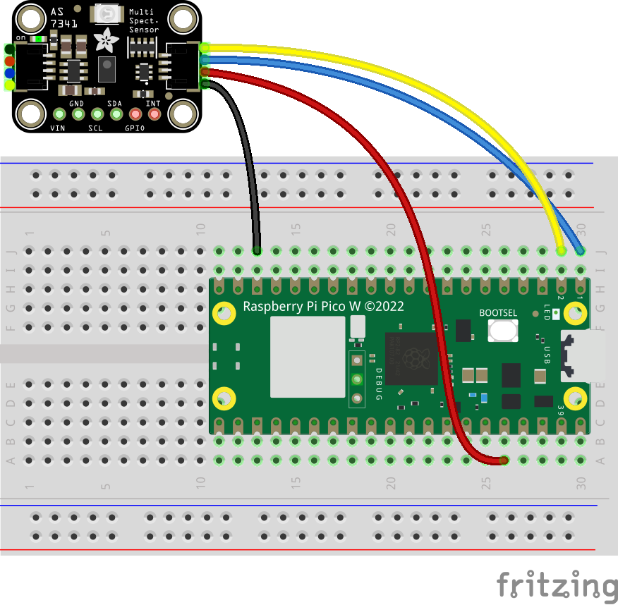

# Spectrometer (AS7341)

## Wiring

:::tip

Source files for this diagram are available [here](https://github.com/AerospaceJam/aerospacejam.github.io/blob/main/docs/challenges/color/color.fzz)

:::



In case the above image is unclear, here's an additional schematic of the wiring as to prevent confusion:


## Code

### Installing required libraries

In order to use the RFID reader with your Pico, you'll first need to install a module.

:::warning

For future reference, you should note down in your codebase's `README.md` the dependencies that your code requires.

:::

<!-- TODO: bundle an auto package installer and wifi connection manager with the codebase template -->

- Open Thonny and connect to your Pico.
- In the shell at the bottom of the window, type in the following commands to connect to your Wi-Fi network, replacing `SSID` and `PASSWORD` with your network's name and password:

  ```py
  import network
  wlan = network.WLAN(network.STA_IF)
  wlan.active(True)
  wlan.connect("SSID","PASSWORD")
  ```

- Now, run the following commands to install the required package:

  ```py
  import mip
  mip.install("github:AHSPC/AS7341_micropython/as7341.py")
  mip.install("github:AHSPC/adafruit_i2c_device_micropython/i2c_device.py")
  mip.install("github:adafruit/Adafruit_CircuitPython_Register/adafruit_register/i2c_bit.py")
  mip.install("github:adafruit/Adafruit_CircuitPython_Register/adafruit_register/i2c_bits.py")
  mip.install("github:adafruit/Adafruit_CircuitPython_Register/adafruit_register/i2c_struct.py")
  ```

### Example code

```py
from machine import SoftI2C, Pin
from as7341 import AS7341

i2c = SoftI2C(sda=Pin(0), scl=Pin(1))
sensor = AS7341(i2c)

# ----- Example usage -----
# sensor.get_readings()
# > {'violet': 9, 'cyan': 39, 'yellow': 106, 'blue': 32, 'red': 103, 'orange': 142, 'green': 75, 'indigo': 21}

# sensor.led = True
# sensor.get_readings()
# sensor.led = False
# > {'violet': 284, 'cyan': 1993, 'yellow': 3930, 'blue': 1944, 'red': 4275, 'orange': 5525, 'green': 2422, 'indigo': 1196}
```
