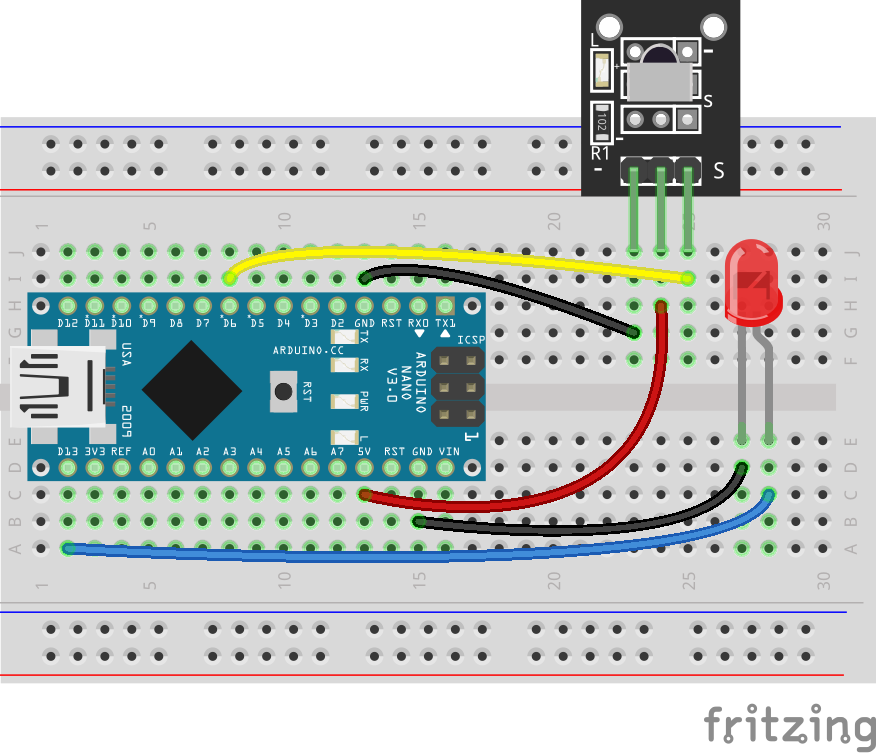

import ReactPlayer from 'react-player'
import DemoUrl from './demo.mp4';

# IR Transmitter

## Building a receiver

This challenge is a little more complicated than the others here - in order to test your transmitter, you must first build a separate receiver.

:::note

On competition day, a more sophisticated receiver (based on a Raspberry Pi 4) will be used to graphically display received data. If you want to build a replica of the competition day receiver, see [here](TODO).

:::

### Wiring

You'll need:

- An Arduino Nano
- An IR receiver ([KY-022](https://arduinomodules.info/ky-022-infrared-receiver-module/))
- An LED of any color (optional)

:::note

You can entirely skip the LED - but if you do, it'll be hard to tell what's happening.

:::



### Getting and flashing the code

Prerequisites:

- A computer with the Arduino IDE
- The IRRemote library installed from the library manager
  
  

- The receiver sketch from [here](https://github.com/AerospaceJam/examples2024/blob/main/ir_receiver_nano/ir_receiver_nano.ino)

Open the code in the Arduino IDE, select the board, and select <kbd>Upload</kbd>.

### Testing it

The technical name for the IR protocol used in this competition is `NEC`. You can find hundreds of compatible TV remotes online - but you'll probably have one laying around. Some common brands that use this protocol include:

- LG
- Samsung
- Spectrum cable boxes

You should be able to press a number on the keypad of the remote and the LED will flash that number of times. The number will also be logged to the serial monitor. If you have any issues, don't hesitate to contact us on the [Discord server](https://discord.gg/mNC7vRhRfs) for help.

## Wiring

Now, we're ready to begin the wiring on the Pico.

You'll need:

- A Pi Pico W
- An IR transmitter ([KY-005](https://arduinomodules.info/ky-005-infrared-transmitter-sensor-module/))


## Code

### Installing required libraries

In order to transmit IR on your Pico, you'll first need to install a module.

:::warning

For future reference, you should note down in your codebase's `README.md` the dependencies that your code requires.

:::

<!-- TODO: bundle an auto package installer and wifi connection manager with the codebase template -->

- Open Thonny and connect to your Pico.
- In the shell at the bottom of the window, type in the following commands to connect to your Wi-Fi network, replacing `SSID` and `PASSWORD` with your network's name and password:

  ```py
  import network
  wlan = network.WLAN(network.STA_IF)
  wlan.active(True)
  wlan.connect("SSID","PASSWORD")
  ```

- Now, run the following commands to install the required package:

  ```py
  import mip
  mip.install("github:peterhinch/micropython_ir/ir_tx")
  ```

### Example Code

```py
from machine import Pin
from ir_tx.nec import NEC
nec = NEC(Pin(6, Pin.OUT, value = 0))

def transmit(value: int):
    global nec
    nec.transmit(1, value) # address == 1, data == value

# ----- Example usage -----
# transmit(5)

# transmit(9)

# val = int(input("Enter a value to send? "))
# transmit(val)
```

## Demo

If everything worked correctly, your end result should look something like this:

<ReactPlayer playing controls url={DemoUrl} playing={false} muted={true} />
