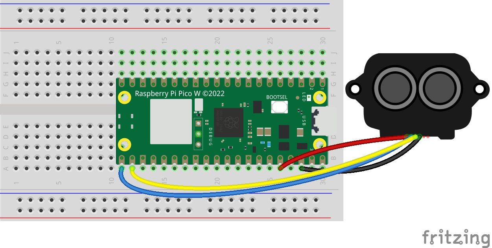

# LiDAR (TF-Luna)

## Wiring

:::tip

Source files for this diagram are available [here](https://github.com/AerospaceJam/aerospacejam.github.io/blob/main/docs/challenges/lidar/lidar.fzz)

:::



In case the above image is unclear, here's an additional schematic of the wiring as to prevent confusion:


## Code

```py
from machine import UART, Pin
import utime
from binascii import hexlify

lidar = UART(0, baudrate=115200, tx=Pin(16), rx=Pin(17))

def save_settings() -> None:
    """Saves the current settings to the Lidar."""
    global lidar
    lidar.write(bytes([0x5a, 0x04, 0x11, 0x6F]))
    utime.sleep_ms(100)

def set_samp_rate(samp_rate: int = 20) -> None:
    """
    Sets the sampling rate of the Lidar.

    Parameters:
    - samp_rate: The desired sampling rate in Hz.
    """
    global lidar
    hex_rate = samp_rate.to_bytes(2, 'big')
    samp_rate_packet = [0x5a, 0x06, 0x03, hex_rate[1], hex_rate[0], 0x00, 0x00]
    lidar.write(bytes(samp_rate_packet))
    utime.sleep(0.1)
    save_settings()

def get_version() -> str:
    """
    Retrieves the Lidar version information.

    Returns:
    - A string representing the Lidar version.

    Raises:
    - RuntimeError: If the version retrieval fails.
    """
    global lidar
    info_packet = [0x5a, 0x04, 0x14, 0x00]
    lidar.write(bytes(info_packet))
    start_tick = utime.time()
    while utime.time() - start_tick < 10:
        if lidar.any() > 0:
            bin_ascii = lidar.read(30)
            if bin_ascii[0] == 0x5a:
                version = bin_ascii[0:].decode('utf-8')
                return version
            else:
                lidar.write(bytes(info_packet))
    raise RuntimeError("Failed to retrieve version.")

def get_lidar_data() -> tuple:
    """
    Retrieves the Lidar distance, strength, and temperature data.

    Returns:
    - A tuple (distance, strength, temperature) with the corresponding values.

    Raises:
    - RuntimeError: If data retrieval fails.
    """
    global lidar
    if lidar.any() > 0:
        bin_ascii = lidar.read(9)
        if bin_ascii[0] == 0x59 and bin_ascii[1] == 0x59:
            distance = bin_ascii[2] + bin_ascii[3] * 256
            strength = bin_ascii[4] + bin_ascii[5] * 256
            temperature = (bin_ascii[6] + bin_ascii[7] * 256) / 8 - 256
            return distance, strength, temperature
    raise RuntimeError("Failed to retrieve Lidar data.")

# ----- Example usage -----
# version = get_version()
# set_samp_rate(20)
# while True:
#     distance, strength, temperature = get_lidar_data()
```

## Further Reading

- https://en.benewake.com/DataDownload/index.aspx?pid=20&lcid=21
- https://forums.raspberrypi.com/viewtopic.php?t=340841
- https://files.seeedstudio.com/wiki/Grove-TF_Mini_LiDAR/res/SJ-PM-TF-Luna-A03-Product-Manual.pdf
- https://www.waveshare.com/wiki/TF-Luna_LiDAR_Range_Sensor
