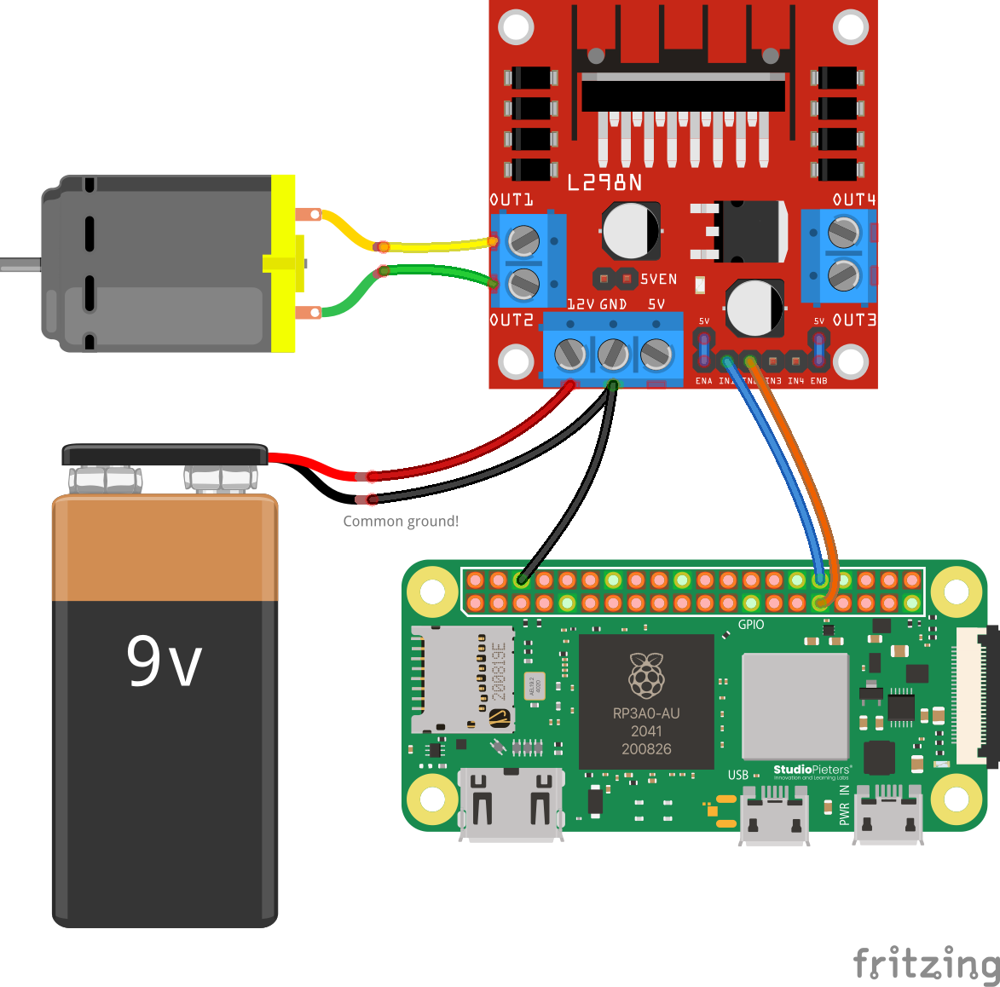

# Motor

This article details how to control the included motor with the motor controller from your Pi.

:::info Heads up!
All of this information assumes that you've read the [*Adding your first interaction* tutorial](/getting-started/first-interaction) and you understand it thoroughly, since this page only gives you the necessary code to run to turn on and off the motor.
:::

## Wiring

:::tip
Source files for this diagram are [available here](https://github.com/AerospaceJam/docs/blob/main/docs/challenges/motor/motor.fzz).
:::



:::danger Watch out!
The wiring for the motor is significantly more complicated than that for other challenges. Be careful when wiring! If you need help, please reach out to competition administrators.
:::

## Code

The code for this is relatively simple, as all we're doing is turning the pins on and off. For this reason, there's no external library we're using besides the built-in Raspberry Pi GPIO library:

```py
import RPi.GPIO as GPIO

# First, we define our two output pins that the motor controller is connected to.
IN1 = 12  # GPIO 12
IN2 = 6   # GPIO 6

# Set the GPIO numbering mode so that it knows how we're referring to the pins
GPIO.setmode(GPIO.BCM)

# Set up the GPIO pins as output
GPIO.setup(IN1, GPIO.OUT)
GPIO.setup(IN2, GPIO.OUT)

# Now, we define three functions to help us set the motor's state. These should be pretty self-explanatory.
def motor_forward():
    """Turns the motor forward"""
    GPIO.output(IN1, GPIO.HIGH)
    GPIO.output(IN2, GPIO.LOW)

def motor_backward():
    """Turns the motor backward"""
    GPIO.output(IN1, GPIO.LOW)
    GPIO.output(IN2, GPIO.HIGH)

def motor_stop():
    """Stops the motor"""
    GPIO.output(IN1, GPIO.LOW)
    GPIO.output(IN2, GPIO.LOW)

# Now, to make the motor do things, for example:
from time import sleep
print("Moving forward...")
motor_forward()
sleep(3)

print("Moving backward...")
motor_backward()
sleep(3)

print("Stopping...")
motor_stop()
sleep(3)
# Easy peasy!
```

Remember that you should call these functions from some sort of interaction with Socket.IO, as outlined in the [*Adding your first interaction* tutorial](/getting-started/first-interaction).

## Troubleshooting

Motor not spinning? Run through this quick checklist:

- **Check Wiring:** Compare your setup closely with the diagram above. Ensure screws on the terminal blocks are tight and jumper wires are fully inserted.
- **Common Ground:** Verify there is a wire connecting a **GND** pin on the Pi to the **GND** block on the motor controller. Without this, the Pi cannot signal the controller.
- **Check Power:**
  - Ensure the L298N controller's red power LED is lit.
  - 9V batteries drain quickly under motor load. Try a fresh battery, or try recharging the battery you currently have plugged in. The battery will have a completely standard USB-C port that you can use to charge it - just plug it into any adapter you have on hand!
- **Verify Code:** Ensure your code is using `GPIO 12` and `GPIO 6`, matching the wiring diagram.
- **Hardware Test:** Briefly touch the two motor wires directly to the 9V battery terminals. If it doesn't spin, the motor itself may be broken.

Still stuck? Reach out to competition administrators for help.
