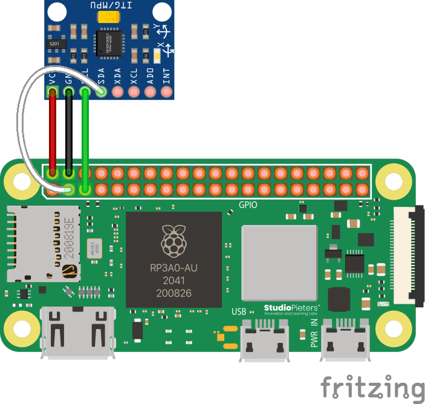

# Accelerometer/Gyroscope (MPU-6050)

## Wiring

:::tip

Source files for this diagram are [available here](https://github.com/AerospaceJam/docs/blob/main/docs/challenges/mpu6050/mpu6050.fzz).

:::

:::info What if I already have something connected there on the Pi?

If you have something already connected to SCL and SDA on your Pi, don't panic! You can just connect to the same two pins for all I2C sensors, as I2C uses a method to communicate that allows it to use only two pins to communicate with many devices on the same "bus".

:::



:::note

If your MPU-6050 is unsoldered, you can either solder wires directly to it, or attach the headers. One way or another, if you need help with soldering, contact a competition administrator on the [Discord](https://discord.com/invite/ShsPVMzpyW) and we can help you with any issues you may be having.

:::

## Code

The necessary library for the MPU-6050 is built-in to the Aerospace Jam SDK. You can use it like this:

```py
from mpu6050 import mpu6050

mpu = mpu6050(0x68) # 0x68 is a special value that points to the MPU-6050 on I2C. You don't need to touch this or worry about it.

accel_data = mpu.get_accel_data()
print(accel_data['x'])
print(accel_data['y'])
print(accel_data['z'])
gyro_data = mpu.get_gyro_data()
print(gyro_data['x'])
print(gyro_data['y'])
print(gyro_data['z'])
```

Note that the gyroscope data is in degrees, and that the acceleration data is in $m/s^2$.

## Troubleshooting

The MPU-6050 is an I2C sensor, and therefore, the [disclaimer regarding I2C in the Appendix](/getting-started/appendix/#i2c-issues-with-the-pisugar-power-supply) remains relevant.

---

## Advanced: Integrating Acceleration

This is a significant challenge that requires concepts from physics and calculus, but successfully implementing it can earn your team the highest score in the Accelerometer/Gyro category (see the [Sensors and Reconnaissance scoring page](/rules/scoring/sensors)). While it's an advanced topic, you don't need to be a calculus expert to implement a basic version.

The core idea is to turn relative acceleration data into an absolute position estimate through a process called **numerical integration**. In calculus, position is the integral of velocity, and velocity is the integral of acceleration.

$v(t) = \int a(t) dt$

$p(t) = \int v(t) dt$

In code, we can approximate this by repeatedly adding up small changes over a tiny time step, $\Delta t$.

1. **Velocity Update:** Your new velocity is your old velocity plus the acceleration you measured, multiplied by the time that has passed since the last measurement.
    $v_{k} = v_{k-1} + a_{k-1} \cdot \Delta t$

2. **Position Update:** Your new position is your old position plus your new velocity, multiplied by that same small amount of time.
    $p_{k} = p_{k-1} + v_{k} \cdot \Delta t$

By running these two calculations in a loop for each axis (X, Y, and Z), you can maintain a running estimate of your drone's position relative to its starting point. This technique is often called "dead reckoning."

:::tip You don't need to be a calculus whiz!
The math might look intimidating, but the code is just a loop with a few multiplications and additions. You can find many code examples online by searching for "**numerical integration accelerometer**" or "**IMU dead reckoning**". The real challenge lies in managing sensor noise and accounting for the constant force of gravity, which your accelerometer will always detect.
:::

## Advanced: Reading Data Manually

This section is for teams who are not using the SDK or who want to write their own sensor library in a different language. The following steps outline the I2C communication and the mathematical formulas required to get data directly from the MPU-6050, based on the logic in the library. If you need more reference code, try [reading it yourself](https://github.com/m-rtijn/mpu6050/blob/master/mpu6050/mpu6050.py), too!

:::danger For Experts Only

These calculations are complex and based on the official datasheet. The process requires careful implementation of I2C read/write commands and specific integer arithmetic. For the ultimate source of truth, please refer to the [InvenSense MPU-6000 and MPU-6050 datasheet](https://invensense.tdk.com/wp-content/uploads/2015/02/MPU-6000-Datasheet1.pdf).

:::

The process can be broken down into three main steps:

1. Wake the MPU-6050 from sleep mode (only needs to be done once at startup).
2. Read the raw 16-bit sensor values for the accelerometer and gyroscope.
3. Convert the raw values to physical units using a scale factor determined by the sensor's current sensitivity range.

### Step 1: Wake Up the MPU-6050

By default, the MPU-6050 starts in a low-power sleep mode. You must wake it up before you can read any data.

1. Write the value `0x00` to the Power Management 1 register (`PWR_MGMT_1`) at address `0x6B`.

### Step 2: Configure Sensor Ranges (Optional but Recommended)

The sensitivity of the accelerometer and gyroscope can be configured. You'll need to know which range is selected to properly convert the raw data. While you can read the registers to see the default, it's good practice to set the range you need.

#### A. Accelerometer Configuration

* **Register:** `ACCEL_CONFIG` at address `0x1C`.
* The scale factor is used to convert the raw integer value to units of *g* (gravitational force).

| Desired Range | Register Value | Raw Value Scale Factor (LSB/*g*) |
| :--- | :--- | :--- |
| ±2*g* | `0x00` | 16384.0 |
| ±4*g* | `0x08` | 8192.0 |
| ±8*g* | `0x10` | 4096.0 |
| ±16*g* | `0x18` | 2048.0 |

#### B. Gyroscope Configuration

* **Register:** `GYRO_CONFIG` at address `0x1B`.
* The scale factor is used to convert the raw integer value to degrees per second (°/s).

| Desired Range | Register Value | Raw Value Scale Factor (LSB/°/s) |
| :--- | :--- | :--- |
| ±250 °/s | `0x00` | 131.0 |
| ±500 °/s | `0x08` | 65.5 |
| ±1000 °/s | `0x10` | 32.8 |
| ±2000 °/s | `0x18` | 16.4 |

### Step 3: Read and Calculate True Values

For each axis of the accelerometer and gyroscope, you need to read two bytes (a signed 16-bit integer in two's complement format) and then apply the appropriate scale factor.

#### A. Read Accelerometer Data

1. Read the 16-bit signed integer for each axis from the corresponding registers:

    | Axis | Register Address (High Byte) |
    | :--- | :--- |
    | X-axis | `0x3B` |
    | Y-axis | `0x3D` |
    | Z-axis | `0x3F` |

2. Calculate the true acceleration using the scale factor from Step 2A:
    `Acceleration (g) = Raw_Value / Scale_Factor`

3. To convert the value from *g* to m/s², multiply by the standard gravity constant, approximately 9.80665.
    `Acceleration (m/s²) = Acceleration (g) * 9.80665`

#### B. Read Gyroscope Data

1. Read the 16-bit signed integer for each axis from the corresponding registers:

    | Axis | Register Address (High Byte) |
    | :--- | :--- |
    | X-axis | `0x43` |
    | Y-axis | `0x45` |
    | Z-axis | `0x47` |

2. Calculate the true angular velocity using the scale factor from Step 2B:
    `Angular Velocity (°/s) = Raw_Value / Scale_Factor`

#### C. Reading Temperature

The MPU-6050 also includes an onboard temperature sensor, which can be read as a signed 16-bit integer from register `0x41`.

1. Read the raw temperature value (`Raw_Temp`) from register `0x41`.
2. Calculate the true temperature using the formula from the datasheet:
    `Temperature (°C) = (Raw_Temp / 340.0) + 36.53`
