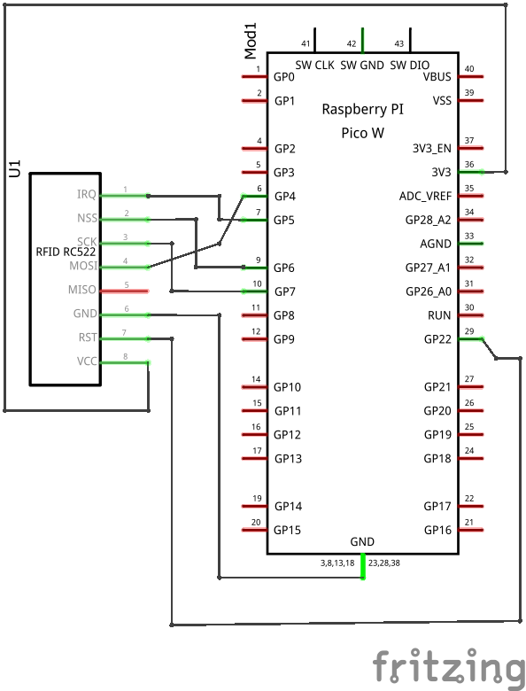

# RFID (RC522)

## Wiring

:::tip

Source files for this diagram are available [here](https://github.com/AerospaceJam/aerospacejam.github.io/blob/main/docs/challenges/rfid/rfid.fzz)

:::


In case the above image is unclear, here's an additional schematic of the wiring as to prevent confusion:



## Code

### Installing required libraries

In order to use the RFID reader with your Pico, you'll first need to install a module.

:::warning

For future reference, you should note down in your codebase's `README.md` the dependencies that your code requires.

:::

<!-- TODO: bundle an auto package installer and wifi connection manager with the codebase template -->

- Open Thonny and connect to your Pico.
- In the shell at the bottom of the window, type in the following commands to connect to your Wi-Fi network, replacing `SSID` and `PASSWORD` with your network's name and password:

  ```py
  import network
  wlan = network.WLAN(network.STA_IF)
  wlan.active(True)
  wlan.connect("SSID","PASSWORD")
  ```

- Now, run the following commands to install the required package:

  ```py
  import mip
  mip.install("github:AerospaceJam/examples2024/mfrc522/mfrc522.py")
  ```

### Example code

```py
from mfrc522 import MFRC522
 
reader = MFRC522(spi_id=0,sck=6,miso=4,mosi=7,cs=5,rst=22)
 
def read_tag() -> int:
    reader.init()
    (stat, tag_type) = reader.request(reader.REQIDL)
    if stat == reader.OK:
        (stat, uid) = reader.SelectTagSN()
        if stat == reader.OK:
            card = int.from_bytes(bytes(uid),"little",False)
            return card
    print("Failed to find a card.")
    return -1

# ----- Example usage -----
# (for all of these examples, make sure a tag is on the reader)
# read_tag()
# > 123456789
```
