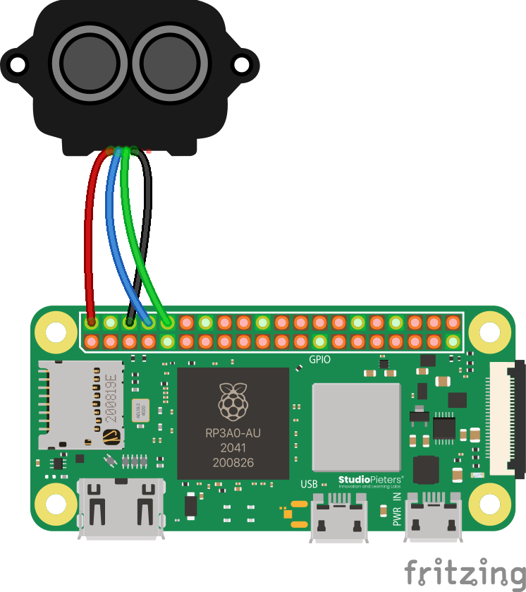
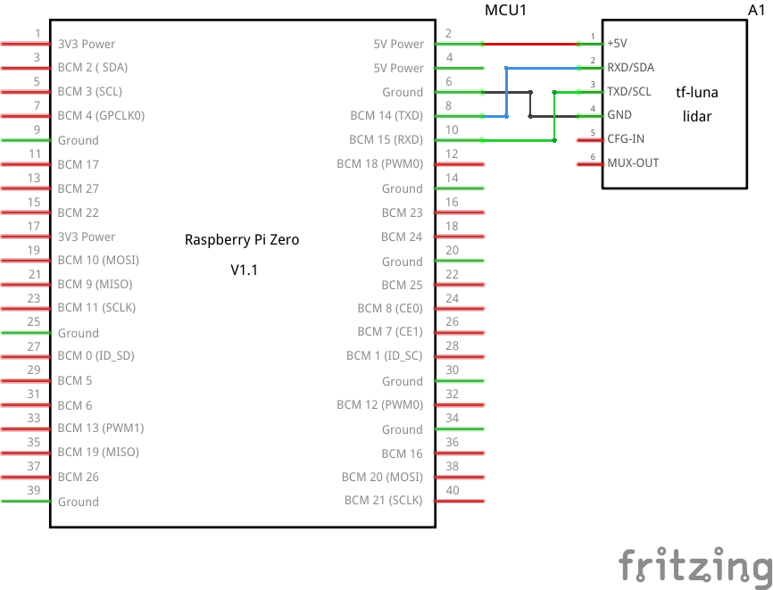

# LiDAR (TF-Luna)

## Wiring

:::tip

Source files for these diagrams are [available here](https://github.com/AerospaceJam/docs/blob/main/docs/challenges/tf-luna/tf-luna.fzz).

:::



If the above diagram is unreadable or unclear, here is an alternate schematic:



:::note

Your TF-Luna can only be connected to with a special connector. The easiest way to connect it to your Pi is to cut off one side and solder your own ends. If you need help with soldering, contact a competition administrator on the [Discord](https://discord.com/invite/ShsPVMzpyW) and we can help you with any issues you may be having.

:::

## Code

Again, like the previous sensors, the necessary library is included in the SDK, and as with the BMP180, Aerospace Jam rolls its own fork of the library for ease of use. You can get the [source code here](https://github.com/AerospaceJam/tfluna). From Python, you can quite easily use the library like this:

```py
from tfluna import TFLuna

tfluna = TFLuna() # Create an object to represent the physical TF-Luna
tfluna.open() # We have to run this to open the sensor. It should be automatically closed when your code stops.
tfluna.set_samp_rate(5) # 5Hz, so 5 samples per second. The higher this number is, the less accurate the measurements are but the faster they come through.

distance, strength, temperature = tfluna.read() # This uses special syntax called a "tuple" to set all three variables at once from the same function.
# Now, we can simply access them:
print(f"Distance: {distance} cm")
print(f"Strength: {strength}")
print(f"Temperature: {temperature} C")
```
