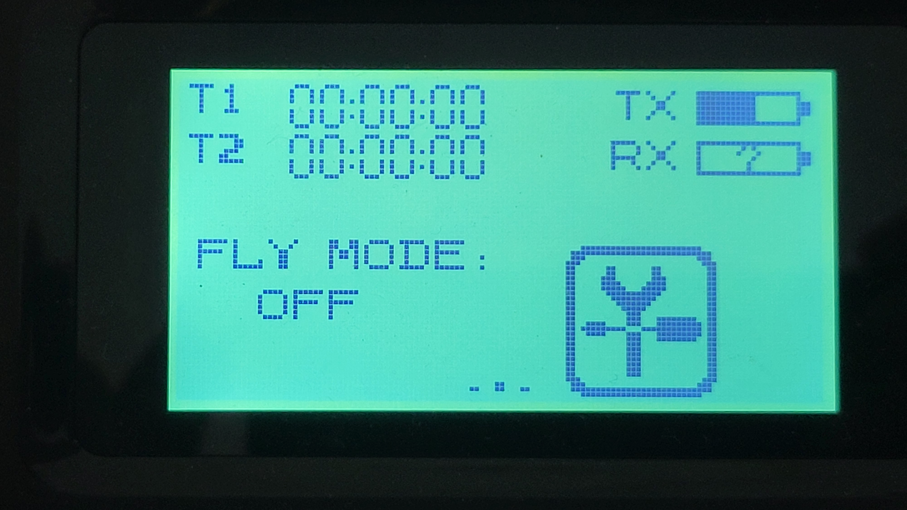
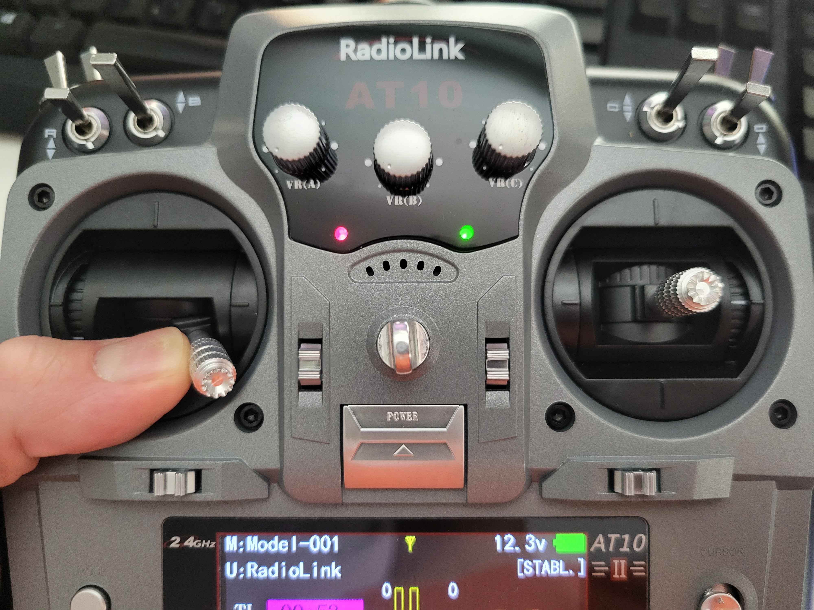
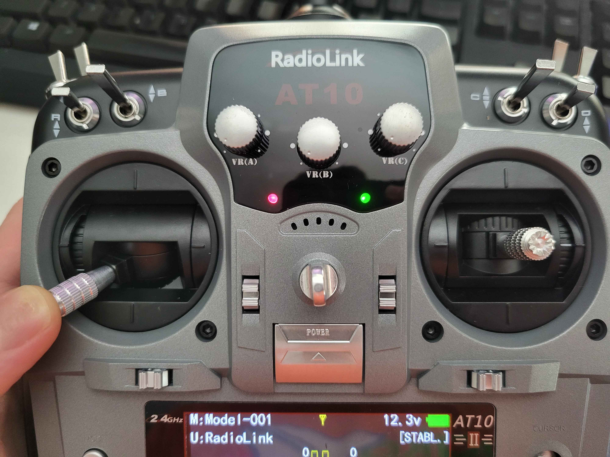
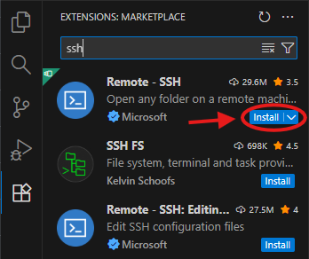
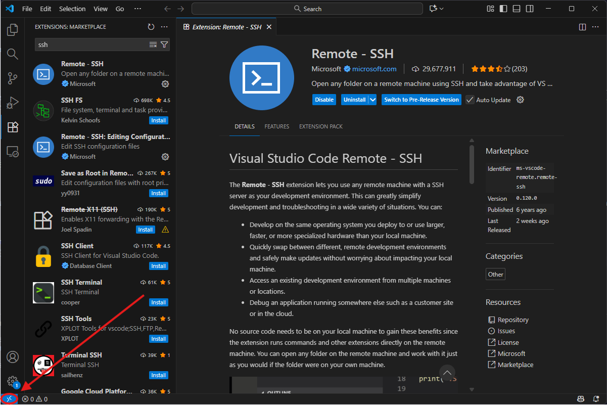
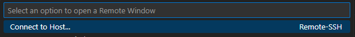
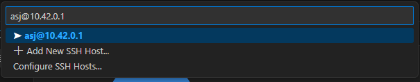
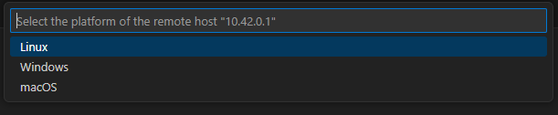

# Appendix

This page contains information that didn't fit anywhere else in this documentation, but is still extremely important.

:::danger

You should read this page in its entirety before trying to fly your drone.

:::

## "Fly Mode"

On some controllers included with older MINDS-I drone kits (namely the Flysky `FS-i6S`), there exists a mostly undocumented mode called "Fly Mode". If your controller has this mode, it will be visible quite plainly on the home screen:



Although it may seem intuitive to enable this mode, ***ABSOLUTELY DON'T***. If Fly Mode is enabled the drone will behave erratically and has been known to take off at high speeds in random directions.

## Arming a Drone

In order to arm your drone, you must pull the throttle stick (on the left) down and to the right (towards the center).



This will cause your drone's motors to spin to life, and allow you to pilot your drone as normal.

## Disarming (Stopping) a Drone

If you're ever flying your drone and crash, or otherwise land and need to shut off your drone urgently, pull the throttle stick (on the left) all the way down and to the left.



This will immediately stop all function of the drone's motors and will require you to disconnect and re-connect the battery in order to resume flight again. Remember to ask the judges presiding over your arena time for permission before entering the net to perform this operation.

## I2C issues with the PiSugar power supply

Some sensors use a protocol called I2C, which requires two reserved pins on your Raspberry Pi. However, when left in its default mode, the PiSugar power supply that we use for Aerospace Jam wil interfere with this protocol and use these two pins for its own purposes, which we don't want. In order to disable it, make sure that the switch on the PiSugar is ***NOT*** set to "auto", and is instead off, as shown in the below picture:


## Advanced Techniques

### Using SSH

Secure SHell, or SSH, is enabled by default on SDK images. SSH allows you to access the shell and files of your Pi without having to connect it to a mouse and keyboard, or a display. If used in combination with a powerful IDE like Visual Studio Code, it allows you to edit all your code without needing to connect your Pi to a monitor every time. In order to connect, there are two options:

**In Competition Mode:**

Open a terminal on a device connected to the Pi's hotspot and run:

```sh
ssh asj@10.42.0.1
```

When prompted, enter the password, `aerospacejam`.

**In Development Mode:**

First, we need to find the IP of the Pi on the non-competition network it's connected to, which is, in most cases dynamic. To do so, you can connect your Pi to a monitor and keyboard/mouse, then connect to the network as you normally would. After connecting, a small pop-up in the top right corner of the screen should appear, telling you your IP. Most likely, it'll be something like `192.168.0.123`, with a few numbers changed here or there. Then, taking this IP over to your other device connected to the same network, open a terminal and run:

```sh
ssh asj@<YOUR PI IP HERE>
```

Replacing `<YOUR PI IP HERE>` with the IP you found earlier. When prompted, enter the password, `aerospacejam`.

### Using SSH in VSCode

If you want to use a more sophisticated IDE, such as VSCode, you can do this over SSH too! As before, you'll first need your Pi's IP. In Competition Mode, this is always `10.42.0.1`, and in Development Mode, it can vary. Once you have it:

- Open a new VSCode window and go to the `Extensions` pane to the left.
- Then, search for `ssh` and install the `Remote - SSH` extension.

  

- Now, click the `Open a remote window` button in the bottom left corner of the window.

  

- Click `Connect to Host...`.

  

- Now, at the text prompt, enter `asj@<YOUR PI IP HERE>`, replacing `<YOUR PI IP HERE>` with the IP you found earlier, or `10.42.0.1` if you're in Competition Mode.

  

- After entering the above, press enter. A new window will open, and it'll ask you what the platform of the remote host is. Select `Linux`.

  

- It will now initialize itself. You may be prompted for a password - if you are, type `aerospacejam` and press enter.
- From the `File` menu, select `Open folder...` and select `teamCode`.
- That's it! You can now edit everything as normal. To get access to a terminal, you can either press ```Ctrl+Shift+` ``` or go to `Terminal -> New Terminal`.
