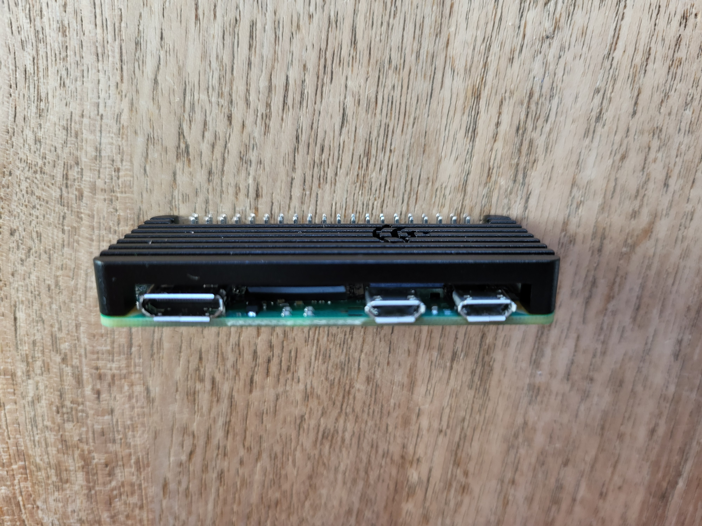
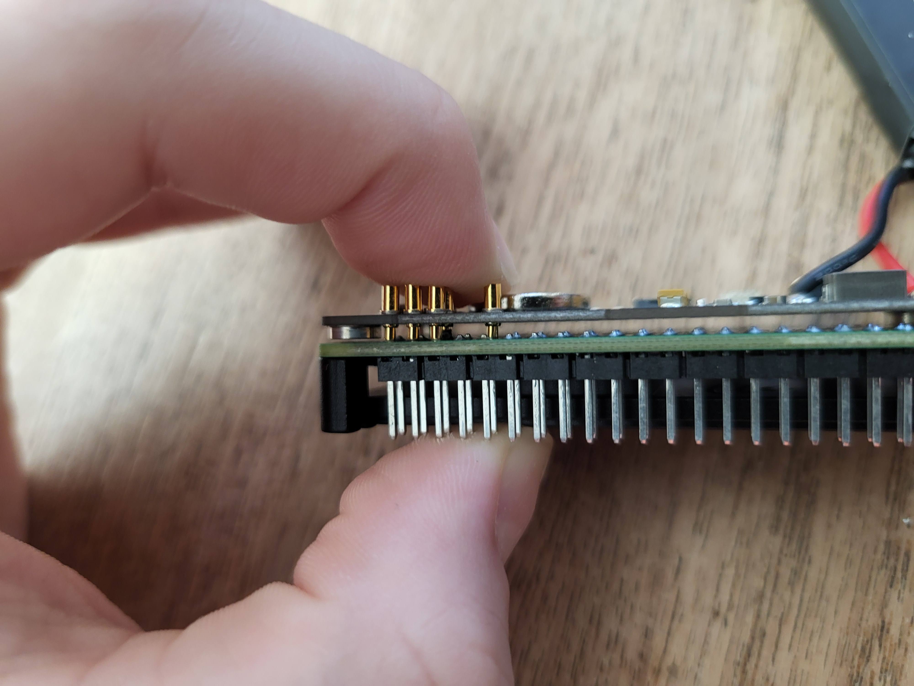
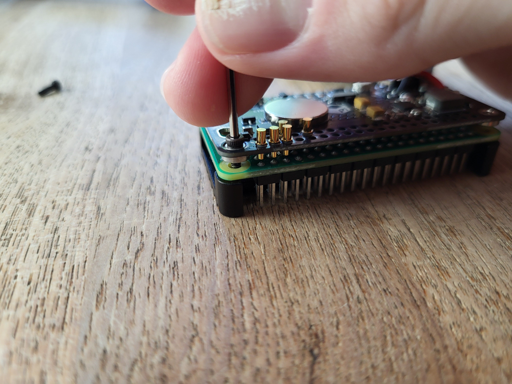

# Assembling the Case

import requiredMaterials from './required_materials.jpg';

Now that we've taken inventory of the contents of our kit, let's put together the case, Pi, and its battery.

## Required Materials

- Your Pi Zero 2WH
- Your PiSugar S battery pack
- Your Pi Zero case
- The two blue heatsink pads from the Pi Zero case kit
- The four **hex head** screws from the Pi Zero case kit and the corresponding hex wrench, also included *(Your case kit may have other screws for different top lids; make sure to use the ones that fit the included hex wrench).*
- The pre-programmed MicroSD card from your kit

These materials are pictured below:

## The top

First, we'll start on the top of the Pi. Get the two heatsink pads. These soft, sticky pads are **thermal heatsinks**. Their job is to transfer heat from the Pi's main chips to the metal case, keeping it cool while it's working hard.

Peel off one side of their plastic covering, then place them down on the Pi as shown below:

Now, peel off the other plastic coverings and push the top of the case down onto the Pi. While the curve of the edges is a good guide, the most important thing is to **make sure the cutouts in the case line up perfectly with the Pi's ports** (HDMI, USB, and SD card slot).

This should lightly stick in place, even without screws, because of the heatsink pads. Still, be careful with it.

## The bottom

Now, flip it over so you can see the bottom of the Pi and the metal of the case is sitting down. Get your PiSugar power supply, and first ***verify that the power switch is in the off position and the switch labeled "auto"  is NOT set to `ON`.***

Then, find where the battery and the Pi sit nicely together. The PiSugar has four spring-loaded 'pogo' pins that need to press directly onto the four corresponding gold-plated pads on the underside of the Pi Zero, like shown below:

:::note

Your PiSugar may have small pieces of orange film over the screw holes, just puncture them with a pointy object and peel them off to screw into them correctly. They're only present there to protect them in shipping.

:::

Holding it together firmly with your fingers (the springy pins will try to push it apart), first screw into the corner nearest to the pins:

Securing this corner first helps 'seat' the two boards together correctly and prevents them from twisting out of alignment while you work on the other corners. Then, screw in the other three corners in any order you see fit.

## Testing our work

Get the MicroSD card from your kit and insert it into the slot on the side of the Pi. Then, plug any power supply into the port on the power supply and flip the switch on the side. You should see both a blue light come on on the bottom of the board, and a green blinking light on the top. If you only see the blue light, then the battery is on but the Pi isn't - so try taking apart and putting back together the entire assembly you just made. If you see just a green light on the top, then that means the Pi is on but the battery pack isn't - which means you plugged a power supply into the wrong port. Try the one on the bottom. If you see neither of the lights, this likely means the battery isn't sufficiently charged, and you should just leave it plugged in for a bit to charge enough to boot the Pi.

If you see both lights, congrats! You're now ready to start working with your Pi.
