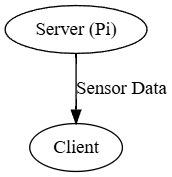
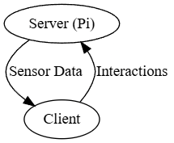

# Adding your first interaction

Now that we can transfer data from our Pi to our clients, we might find ourselves needing to send data backwards: from the client back to the Pi. This can be used to do many, many things, but what this is especially important for is our ability to trigger things to happen on the Pi, such as motors, when we click something on the client, like a button.

So, let's do exactly that! In this tutorial, we program a button on the client side that triggers a function to be called on the Pi's server side, which should give you the framework to move forward with the rest of the competition.

## Understanding Socket.io events

:::tip What are "Clients" and "Servers" Anyway?

It's helpful to think of this relationship like a restaurant.

- The **Server** (your Raspberry Pi) is the **kitchen**. It has all the ingredients (the sensors, the code) and does all the work of preparing the food (processing data).
- The **Client** (your web browser) is the **customer** at the table. The customer can read the menu (see the webpage) and place an order (click a button).

In our first example, the kitchen was just sending out plates of food (sensor data) on a schedule. Now, we're adding the ability for the customer to place a specific order (send an event) that tells the kitchen what to do.

:::

First, in order to understand how we make something interactive on the page to trigger an action, we need to understand how Socket.io, the common code library we're using to handle communication between the Pi and our client, handles "events". In Socket.io, events are how data is actually processed back and forth. In the code you've previously written (and the example template in the SDK), Socket.io is only ***sending*** data. This means, that between the client and server, information is only flowing one way: from the server to the client. This information is our sensor data. Basically, right now, our architecture looks like this:



But, in order to make things on the client interact with the server, we have to have our architecture look more like this:



So how do we do that? Well, remember how we're sending an event from the server to the client? Here's the code:

```py
        socketio.emit(
            'update_data',
            {
                'randomNumber': random.randint(1, 100),
                'barometricPressure': barometricPressure
            }
        )
```

Let's break this down even further. This function call, to `socketio.emit`, consists of two parts. The first is the ***name*** of the event: `'update_data'`. The other is the ***message***, or the data itself:

```py
{
    'randomNumber': random.randint(1, 100),
    'barometricPressure': barometricPressure
}
```

This is the data that's sent to the client, which we can then access once we receive the event named `'update_data'`. Here's the code on the client to do just that...

```js
socket.on('update_data', function(msg) {
    var randomNumberSpan = document.getElementById('randomNumber');
    randomNumberSpan.textContent = msg.randomNumber;
    var barometricPressureSpan = document.getElementById('barometricPressure');
    barometricPressureSpan.textContent = msg.barometricPressure;
});
```

Notice how it accesses `msg`, which is shorthand for "message". And notice again how it refers to the same even name - `'update_data'`. If this name didn't match on both sides, the event wouldn't be received and would just instead be ignored. It also gets the same two parts of the message that we defined earlier - `randomNumber` and `barometricPressure`, notably.

## Incorporating events

So, what have we learned? We can listen for a message on the client side by using `socket.on`, and we can emit a message on the server side by using `socketio.emit`. What would happen if we flipped these? Let's try:

(On the server-side)

```py
@socketio.on('do_a_thing')
def do_a_thing(msg):
    # 'msg' will contain the data sent from the client, like how we had it before.
    # Let's print what we just received to the console!
    print(msg['hello'])
```

This should listen, on the server side, for an event named `'do_a_thing'` with a message containing a field named `'hello'`. But now, how do we make a button or something clickable for the client to use to trigger this to happen?

## HTML, JS, and DOM listeners, oh my!

In order to make some Javascript code run when a user clicks a button, we use something called a ***Document-Object Model listener***, or a DOM listener. In the code we already have, we have one of those listeners:

```js
        document.addEventListener('DOMContentLoaded', function() {
            // ...
        });
```

This adds an event listener to the document, which will wait until the DOM content (or, in non-confusing terms, everything that's on the page) is done loading from the server. This makes sure that our code ONLY starts running once it's ready to actually do what it's supposed to - otherwise, it might start too early, while parts of the page haven't loaded yet.

But this event, `'DOMContentLoaded'`, is just one of many events we can listen for from our Javascript. The one we're really interested in is `'click'`, which is triggered when a user clicks the element. In our HTML, let's add a button like this:

```html
<button id="doAThingButton">Click me to do a thing on the server!</button>
```

Note that we **must** give the button an ID, or else we won't be able to access it from our Javascript. Think of the `id` as a unique name. Just like you can't find a specific person in a crowded room without knowing their name, our Javascript code can't find our specific button on a busy webpage without its unique ID. In the above code, the ID is `'doAThingButton'`, as it's set in the element attribute.

Now we need to make the button do something. But first, we have a classic "chicken and egg" problem. We can't tell our button to listen for clicks if the button doesn't exist yet! If our Javascript code runs before the browser has finished building the HTML page, it will look for the button, find nothing, and give up. To solve this, we use the same special "master" event listener - `DOMContentLoaded` - from earlier.

We grab the element by this ID in our existing DOM listener:

```js
        // Once the page is loaded...
        document.addEventListener('DOMContentLoaded', function() {
            // Find the button and assign it to a variable...
            var doAThingButton = document.getElementById('doAThingButton');
            // And then, once we click the button...
            doAThingButton.addEventListener('click', function() {
                // Run whatever code is in here!
                // ...
            });
        });
```

See it all coming together now? Now, any code that we place where the comment (`// ...`) is now will be executed when we click on the button.

## Putting it all together

Now that we can listen for the new Socket.io event, `'do_a_thing'`, on the server side, and we can run code when we click a button on the client side, how do we tie it together and send an event? It's simple - like this!

```js
            doAThingButton.addEventListener('click', function() {
                socket.emit('do_a_thing', { hello: 'Hello, Aerospace Jam! This is a message being sent from the client to the server.' });
            });
```

Notice that when we call `socket.emit`, it follows the exact same pattern as in the Python earlier - first, we specify the event name, then we specify the message.

Let's look at the finished HTML code, based on where we left off in the last tutorial (with a working barometric pressure sensor):

```html
<!DOCTYPE html>
<html>
<head>
    <!-- All of this is unchanged... -->
    <title>Aerospace Jam Example</title>
    <script src="{{ url_for('static', filename='js/socket.io.js') }}"></script>
</head>
<body>
    <!-- All of this was here before... -->
    <h1>Aerospace Jam Example</h1>
    <p><b>Random number chosen by the Pi: </b> <span id="randomNumber">Loading...</span></p>
    <p><b>Barometric Pressure: </b> <span id="barometricPressure">Loading...</span> hPa</p>
    <!-- Now, we add this button: -->
    <button id="doAThingButton">Click me to do a thing on the server!</button>
    <script>
        document.addEventListener('DOMContentLoaded', function() {
            var socket = io.connect('http://' + document.domain + ':' + location.port);
            socket.on('update_data', function(msg) {
                var randomNumberSpan = document.getElementById('randomNumber');
                randomNumberSpan.textContent = msg.randomNumber;
                var barometricPressureSpan = document.getElementById('barometricPressure');
                barometricPressureSpan.textContent = msg.barometricPressure;
            });
            // And here, we set up our event listener for when we click the button:
            var doAThingButton = document.getElementById('doAThingButton');
            doAThingButton.addEventListener('click', function() {
                socket.emit('do_a_thing', { hello: 'Hello, Aerospace Jam! This is a message being sent from the client to the server.' });
            });
        });
    </script>
</body>
</html>
```

And the finished server code:

```py
# Everything here is unchanged...
from flask import Flask, render_template
from flask_socketio import SocketIO
import random
from bmp180 import BMP180

app = Flask(__name__)
socketio = SocketIO(app)
bmp = BMP180()

@app.route('/')
def index():
    return render_template('index.html')

def background_thread():
    while True:
        socketio.sleep(1)
        barometricPressure = bmp.get_pressure()
        socketio.emit(
            'update_data',
            {
                'randomNumber': random.randint(1, 100),
                'barometricPressure': barometricPressure
            }
        )

@socketio.on('connect')
def handle_connect():
    print('Client connected')
    socketio.start_background_task(target=background_thread)

# Added:
@socketio.on('do_a_thing')
def do_a_thing(msg):
    print(msg['hello'])

def main():
    socketio.run(app, host='0.0.0.0', port=80, allow_unsafe_werkzeug=True)

if __name__ == '__main__':
    main()
```

## Testing it

Now, try enabling Development Mode and running this code in Thonny. In the `Shell` window at the bottom, you should see a lot of Socket.io logs, which you can mostly ignore. But once you click the button from a connected client, a message will briefly appear:

```txt
GET /socket.io/..........
Hello, Aerospace Jam! This is a message being sent from the client to the server.
```

Congratulations - you've now successfully triggered code to run on the server from an interaction on the client!

## Notes

:::danger Watch Out for These Common Mistakes!

If your button click isn't working, check these things first:

1. The event name must be **exactly** the same on the client and the server. `'do_a_thing'` is not the same as `'do_a_Thing'` or `'do_a_thing '` (with a space). Copy and paste the name to be sure!

2. Check that your `<button>` in the HTML has an `id="..."` and that the `getElementById('...')` in your Javascript uses the exact same ID.

3. A single typo in your Javascript can cause the whole script to stop working. Use the browser's Developer Console (usually opened with F12) to check for red error messages. If you're on a school-managed device, like a Chromebook, you may not be able to access the Developer Console - try a personal device for debugging!

:::

### Sending events without messages

Although in this example we've been primarily illustrating how to send an event ***with*** a message to the server, you can also send an event ***without*** a message or data of any kind, just to trigger something to happen with no other parameters. To do so, just call `socket.emit` with only an event name, like so:

```js
socket.emit('do_a_thing');
```

If you're not sending any data to the server and just need to trigger a static piece of code to run, this is much cleaner.

:::tip

This also works vice versa, from the server to the client (e.g. with `socketio.emit('<event_name>')`), but you probably won't have to worry about this in most cases.

:::

## Still confused?

If you're still struggling to get interactions between the client and server working, please ask for help in the [Discord](https://discord.gg/ShsPVMzpyW). We don't bite, I promise!
