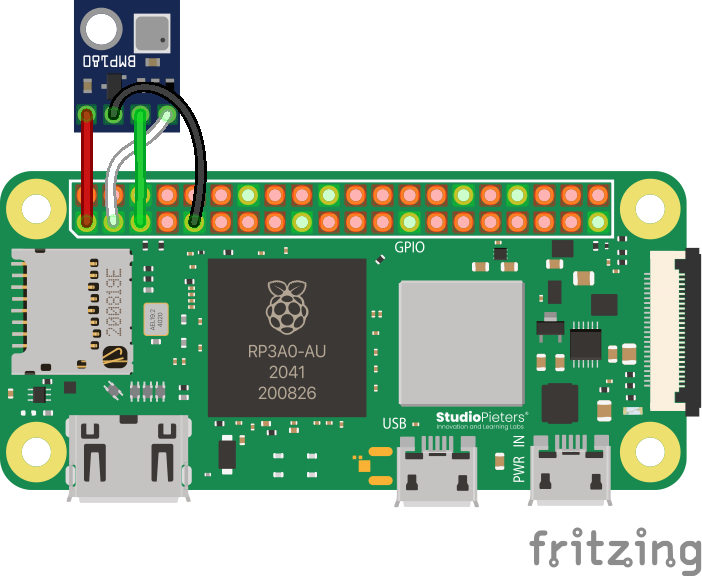
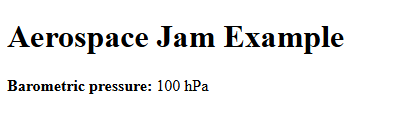
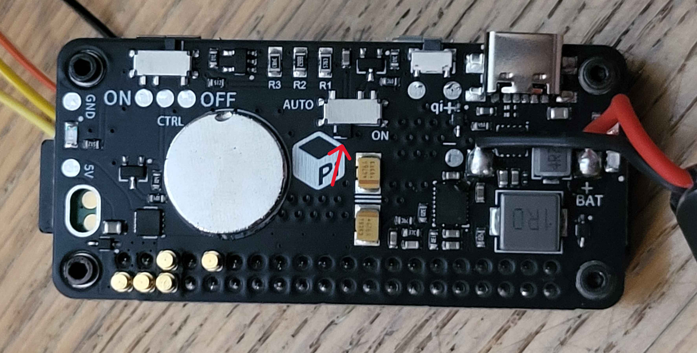

# Adding your first sensor

In this tutorial, we're going to add our first sensor to our Pi. This will be the BMP180 barometric pressure sensor.

## Wiring

First, you'll need to physically connect the BMP180 sensor to your Pi's GPIO (General Purpose Input and Output) pins. Follow the wiring diagram below carefully.

:::info What are SDA and SCL?

The BMP180 sensor communicates with the Pi using a protocol called **I2C** (Inter-Integrated Circuit). This protocol only needs two main wires:

- **SDA (Serial Data)**: The wire that sends the actual data back and forth.
- **SCL (Serial Clock)**: The wire that keeps the communication between the Pi and the sensor in sync.

It's not critical to know the details, but it's why these two pins are so important!

:::



:::danger Use 3.3V, NOT 5V!

Your Raspberry Pi has both 3.3-volt and 5-volt power pins. The BMP180 sensor is designed to run on **3.3V**. Connecting it to a 5V pin can permanently damage the sensor! Always double-check you are connected to the correct pin.

:::

:::warning Check Your Pins Twice!

The most common point of failure is a simple wiring mistake. Make sure the SDA and SCL pins are connected to the correct corresponding pins on the Pi. If you have them flipped, your code won't be able to find the sensor, and it can be very difficult to debug.

:::

:::note

If your BMP180 is unsoldered, you can either solder wires directly to it, or attach the headers. One way or another, if you need help with soldering, contact a competition administrator on the [Discord](https://discord.com/invite/ShsPVMzpyW) and we can help you with any issues you may be having.

:::

## Code

First, open your `teamCode` in Thonny, as described in the previous tutorial.

### Server

Just like `Flask` helps us run a web server, we need a special library to help us talk to the BMP180.

In `main.py`, find the "import" section at the top and add the line for the `BMP180`.

```py
# These two modules allow us to run a web server.
from flask import Flask, render_template
from flask_socketio import SocketIO
# This module lets us pick random numbers.
import random
# Add this line to import the BMP180 library:
from bmp180 import BMP180
```

Now that we've imported the library, we need to create an "object" in our code that represents the physical sensor. This gives us a variable we can use to ask for data.

Add this line before the `background_thread` function definition.

```py
# ... after the app and socketio lines
app = Flask(__name__)
socketio = SocketIO(app)

# Create an object to represent our BMP180 sensor
bmp = BMP180()

# This function runs in the background...
def background_thread():
    # ...
```

Finally, let's modify the `background_thread` to read from the sensor and add its data to the message we send to the client.

```py
def background_thread():
    while True:
        socketio.sleep(1)

        # First, we ask our sensor object for the current pressure
        barometricPressure = bmp.get_pressure()

        # Now, we add it to the message we're sending
        socketio.emit(
            'update_data',
            {
                'randomNumber': random.randint(1, 100),
                # Add a new pair for our pressure data
                'barometricPressure': barometricPressure
            }
        )
```

:::note

You can download the full example `main.py` file [here](./full_barometric.py).

:::

### Client

Our server is now sending pressure data, but our webpage doesn't know what to do with it yet. Let's fix that.

Still in Thonny, open `templates/index.html`. First, we need to add a spot on the page itself for the data to go. To do so, we add:

```html
<body>
    <h1>Aerospace Jam Example</h1>
    <p><b>Random number chosen by the Pi: </b> <span id="randomNumber">Loading...</span></p>
    <!-- Here we add a tag for this new data: -->
    <p><b>Barometric pressure: </b> <span id="barometricPressure">Loading...</span> hPa</p> <!-- Note that you can add a unit to the end too, like we did here with `hPa`! -->
    <!-- Everything else is unchanged... -->
</body>
```

Notice we gave our `<span>` the unique `id="barometricPressure"`. This is crucial for our Javascript to find it. We also added "hPa" (Hectopascals) outside the span as a unit label.

Now, we'll add to our script to find the new `<span>` and update its text with the data from the server.

```html
<script>
    document.addEventListener('DOMContentLoaded', function() {
        var socket = io.connect('http://' + document.domain + ':' + location.port);

        socket.on('update_data', function(msg) {
            // This part is the same as before
            var randomNumberSpan = document.getElementById('randomNumber');
            randomNumberSpan.textContent = msg.randomNumber;

            // Add these two lines to update the pressure
            var barometricPressureSpan = document.getElementById('barometricPressure');
            barometricPressureSpan.textContent = msg.barometricPressure;
        });
    });
</script>
```

:::note

You can download the full example `index.html` file [here](./full_barometric.txt).

:::

## Running it

You're ready to go! Run `main.py` using either Development Mode or Competition Mode as described in the [SDK Intro tutorial](/getting-started/sdk-intro). If all goes well, you'll see the live pressure reading on your webpage!



## Troubleshooting

If your page loads but the pressure always says "Loading..." or the program crashes, work through this checklist.

#### 1. Check the Wiring

This is the #1 cause of sensor issues.

- Is `VIN` or `VCC` on the sensor connected to a **3.3V** pin on the Pi?
- Is `GND` connected to a `GND` (Ground) pin?
- Is `SDA` on the sensor connected to the `SDA` pin on the Pi (GPIO 2)?
- Is `SCL` on the sensor connected to the `SCL` pin on the Pi (GPIO 3)?

#### 2. Check for I2C and Power Issues

- **Is I2C enabled?** Run `sudo raspi-config nonint get_i2c`. If it returns `0`, it's enabled. If it returns `1`, it's disabled. Run `sudo raspi-config nonint do_i2c 0` to enable it.
- **Is the PiSugar switch correct?** Verify the switch labeled "auto" on your PiSugar power supply is ***NOT*** set to the `ON` position, as it can interfere with the I2C pins.
  

#### 3. Check the Code

- Did you add the `barometricPressure` key to **both** `main.py` (when sending the message) and `index.html` (when reading the message)? A typo in either name (`barometricPressure` vs `barometricPresure`) will cause it to fail silently.

#### 4. Check if the Pi Can See the Sensor

Your Pi has a built-in tool to scan for connected I2C devices.

1. Open a new Terminal in Thonny (`Tools > Open system shell`).
2. Run the command: `i2cdetect -y 1`
3. You should see a grid of numbers. If the sensor is connected correctly, you will see `77` somewhere in the grid.
    - **If you see `77`:** The wiring is correct! The problem is likely in your code.
    - **If you don't see `77`:** The Pi cannot detect your sensor. The problem is almost certainly your wiring or a faulty sensor. Go back to step 1.
