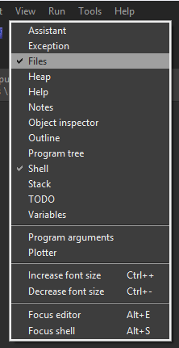

# Using the Aerospace Jam SDK

This year, we've introduced a new **S**oftware **D**evelopment **K**it (SDK) to make writing code for Aerospace Jam easier. Think of the SDK as a custom version of the Raspberry Pi's operating system, pre-loaded with all the tools, libraries, and shortcuts you'll need. This guide walks you through the basics.

:::info For the Power Users

The SDK is a modified version of Raspberry Pi OS, generated [with these scripts](https://github.com/AerospaceJam/sdk). If you're a power user, you can also just use a stock Raspberry Pi OS, or any other `aarch64` distro of your choice, but these will only be partially supported and won't receive the same support priority if you encounter issues with them. If you ask in the Discord, though, we'll try to give you as much help as we can, regardless of what software you choose to use!

:::

## Prerequisites

- A monitor, keyboard, and mouse
- The white MicroUSB hub included with the Pi kit
- The HDMI cable included with the Pi kit
- The assembled Pi Zero from the last step

## Plugging Everything In

Let's get your Pi set up as a temporary desktop computer.

1. **Connect Peripherals:** Plug the white MicroUSB hub into the Pi's **data** port. This is the middle MicroUSB port, the one that is *not* labeled for power.
2. **Connect Display:** Plug the HDMI cable into the Pi's Mini HDMI port and into your monitor.
3. **Connect Input:** Connect your keyboard and mouse to the USB hub.
4. **Power Up:** Finally, plug a USB-C power supply into the port on the **PiSugar battery pack** and flip the switch on. The Pi will begin to boot up immediately.

## Understanding the Modes

The SDK has two modes of operation: **Development Mode** and **Competition Mode**. You will switch between them frequently.

| Mode | Wi-Fi Behavior | Purpose | How Code Runs |
| :--- | :--- | :--- | :--- |
| **Development Mode** | Connects to existing Wi-Fi networks (like a laptop). | Writing, testing, and debugging your code. Gives you internet access to download tools or look up documentation. | **Manually**, by pressing the "Run" button in your code editor (Thonny), or by `sudo systemctl start teamcode`. |
| **Competition Mode** | Creates its own Wi-Fi hotspot. | The official mode for competition day. Your laptop connects *to the Pi*. No internet access is allowed. | **Automatically** starts your `main.py` script as soon as the mode is enabled. |

You can switch between modes using the shortcuts on the desktop. When you double-click one, you may be prompted to choose an action; just click **"Execute"**.

:::info Hotspot Password

No matter what you name your hotspot, the password is always `aerospacejam`.

:::

## Writing Code

By default, a template project is located in `/home/asj/teamCode`. `/home/asj` is shortened to `~` on your Pi - so sometimes you'll also see this referred to in these docs as `~/teamCode`. This folder is, as the name implies, where all your team code should live for the competition. By default, the system launches `main.py` in this directory when you start up your Pi in Competition Mode, and will shut down the running `main.py` when you enter Development Mode.

To write your code, you'll use Thonny, a specialized Python Integrated Development Environment (or IDE) made specifically for beginners. If you've competed in Aerospace Jam in past years, this will be familiar to you.

:::note

If you're experienced, you can write your code however you want. In the perfect world, you could write your code on an external device with a more sophisticated IDE like Visual Studio Code, then just push the files over with a networked git repo, such as one on Github - but this may be advanced for beginning teams. Don't worry if Thonny is easier for you!

:::

There is a desktop shortcut that opens Thonny, or you can find it in the start menu under the `Programming` category. From there, make sure that <kbd>View -> Files</kbd> and <kbd>View -> Shell</kbd> are both checked, as shown in the below image:



On the left pane, you'll now see a `Files` tab. It will start by default in `/home/asj` - so double-click on `teamCode` to open up your code. Then, double-click `main.py` or any other file or folder you want to open and you can edit the code freely!

Before continuing to the next section, head back to the desktop and double-click the Development Mode shortcut to enable it.

:::tip If you don't want to use Thonny...
You can also SSH into your Pi and use Visual Studio Code. To find out how, read [this section of the Appendix](/getting-started/appendix/#using-ssh-in-vscode)!
:::

## Running Code (Development Mode)

:::info What is an IP Address?

An IP address is like a street address for a device on a network. The `127.0.0.1` address is special; it always means "this computer itself". To connect from *another* device, you need the real "street address," which is the one that usually starts with `192.168.x.x` or `10.x.x.x`.

:::

Remember from before that whatever you put in `main.py` will run automatically when the Pi starts up on your drone in Competition Mode. But, when we're in Development Mode, our code doesn't start up automatically, so we can debug it through our IDE.

First, in Development Mode, let's connect our Pi to a network that we can access it on. For this, you can use a personal network, one hosted by a router you own, or a mobile hotspot - school networks will most likely not work in 99% of cases.

Once you're connected, open up `main.py` in Thonny, then click the green play button to run it. In the `Shell` window on the bottom of the screen, you should see a list of web addresses - this will include:

```txt
 * Running on http://127.0.0.1:80
 * Running on http://192.168.0.***:80
```

In this list, look for the second option - it will most likely either start with `192.168.***.***` or `10.***.***.***`. This is your Pi's IP address - connect another device to the same network your Pi is now connected to, and then enter this address in your web browser. You should see a screen like this!


Great work! We've now successfully ran the example code on the Pi and connected from a base station! Now, let's try it in Competition Mode!

## Running Code (Competition Mode)

In competition mode, things are simpler. Your code starts automatically.

1. **Stop the Old Process:** In Thonny, click the red **Stop** button to end the development run. This is important!
2. **Switch to Competition Mode:** Go to the desktop and double-click the **Competition Mode** shortcut. It will turn your Pi into a Wi-Fi hotspot and automatically launch your `main.py` script in the background.
3. **Connect to the Pi's Hotspot:** On your laptop or phone, find the Wi-Fi network broadcast by your Pi and connect to it (password: `aerospacejam`).
4. **Visit the Competition Address:** On that same device, open a web browser and go to **http://10.42.0.1/**. This address is static and will ALWAYS be the address of your Pi in competition mode. You should see the same webpage as before!

## Next Steps

Now that you know how to use the Aerospace Jam SDK, we can move on to setting up your project on a git repository so that you can easily track your changes throughout the season.
