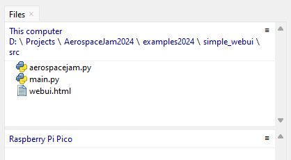
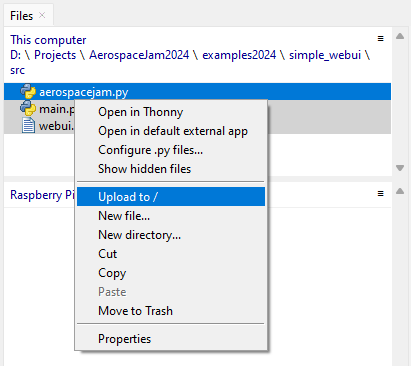
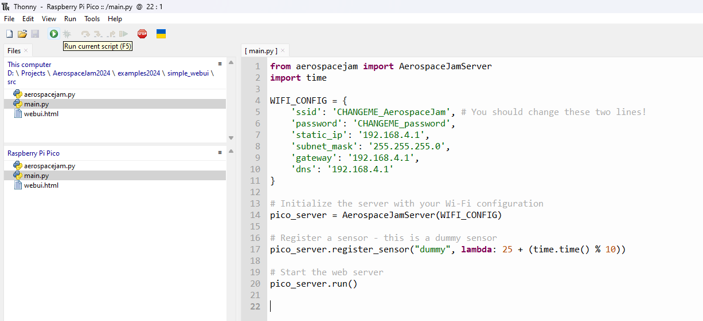

# Testing it All / Transferring the code to the Pi

:::note

A video version of these initial tutorials is available [here](https://youtu.be/NYSr9h0jw7k).

:::

## Prerequisites

For this guide, you'll need:

- A computer with the tools from previous parts of this guide installed, and your project folder
- Thonny opened on the computer and connected to your Pi

## Opening your project in Thonny

:::warning

If you've followed this guide before, you should first delete all files on your Pi before re-uploading them.

:::

- At the top of the Thonny window, select <kbd>View</kbd> > <kbd>Files</kbd>.
- In the pane that appears to the left, use the top section to navigate to your project folder. If you're following this guide through and are using the example project layout, also navigate into the `src` folder.
  
  

- Select all the folders on your computer with <kbd>Ctrl+Click</kbd> and right-click them - select `Upload to /`.

  

- Now, you should be able to see all your files on your Pico's files pane. By default, the file named `main.py` will be run when you plug in your Pico.
- From Thonny, double-click `main.py` on your Pi's file pane, and click the `Run` button (or press <kbd>F5</kbd>)

  

- You should see output in the bottom terminal pane that looks like this:

  ```log
  >>> %Run -c $EDITOR_CONTENT

  MPY: soft reboot
  Hotspot CHANGEME_AerospaceJam started with IP: 192.168.4.1
  Web server running on http://192.168.4.1/
  ```

- Now, we can connect to the Pi to verify that everything is working.

## Connecting to your Pi

- First, connect to your Pi's Wi-Fi hotspot. By default, this network is named `CHANGEME_AerospaceJam`, with the password `CHANGEME_password`.

  

- Now, navigate to `http://192.168.4.1/` in your browser and verify that the WebUI is visible.
- If you can see a WebUI in your browser, congratulations! You've completed the basic setup and are now ready to begin writing code for your sensors and beautifying your base station.

  