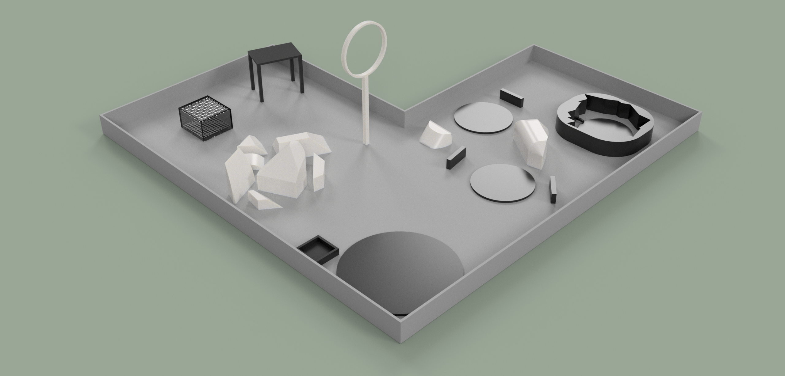
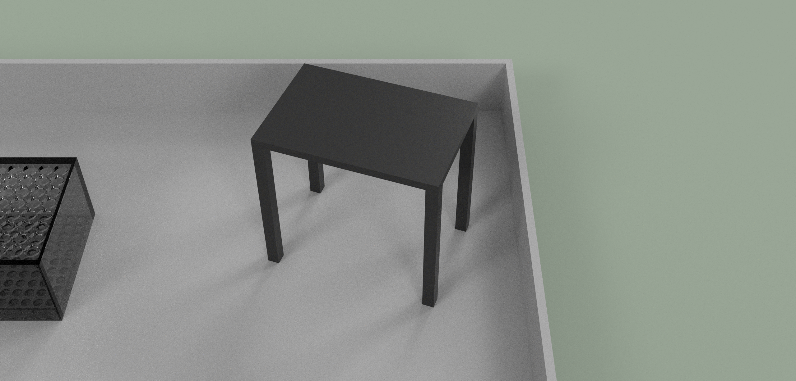
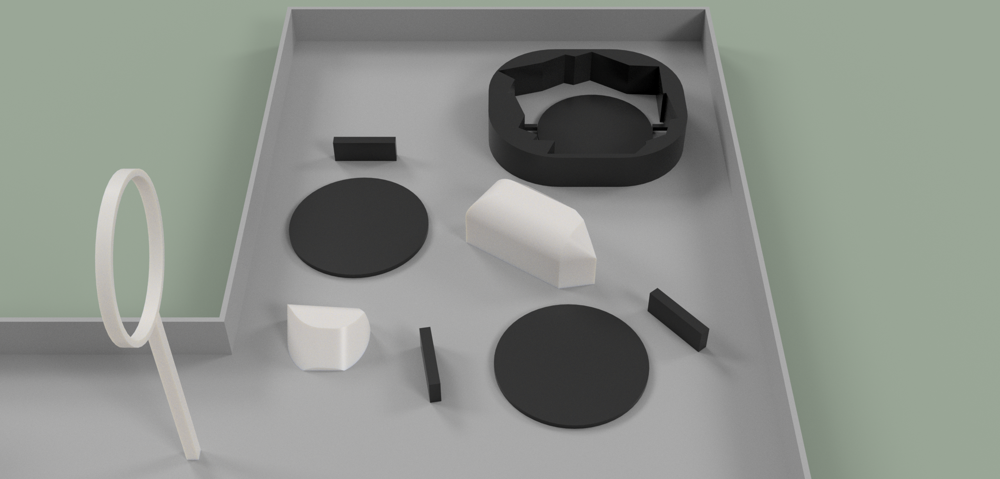
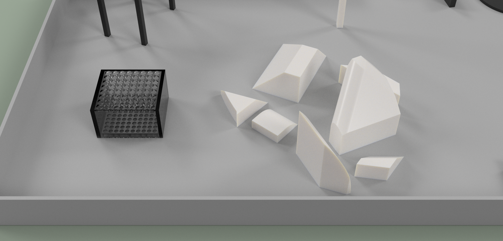

# Arena Specification

This page documents the basic specifications of the arena that will be used on [competition day](/#season-dates). Note that all mockups and renders comply with these specifications, but they do not neccesarily reflect what the practice arenas or the competition arenas will look like on competition day, although the competition day or officially provided practice arenas ***must*** comply with these specifications. CAD models for Fusion 360 and in the common STEP format [are available for download](#cad-downloads)!

## Overview

At a high level, the arena contains neccesary structures to complete the following [Sensor challenges](/rules/scoring/sensors):

- Targets for [LiDAR sensing](/rules/scoring/sensors/#lidar-up-to-15-points)
- An elevated platform as a target for the [camera](/rules/scoring/sensors/#camera-up-to-10-points)
- An enclosed box with holes for retrieving [payloads](/rules/scoring/sensors/#payload-manipulation-up-to-35-points---cumulative), and a target location to drop payloads in

As well as this, the arena contains neccesary landing targets and obstacles to complete all [Navigation challenges](/rules/scoring/faa-and-navigation), including an elevated vertical hoop to fly through and (optionally) various obstacles to prevent navigation near the ground in certain sections of the arena.

:::note
All arenas will be entirely contained within nets for safety. These are omitted from renders and CAD models for the sake of clarity, but note that they are still present.
:::

## Navigation

In order to fulfill all requirements for all arena-related categories in the Navigation Scoring, every arena will be equipped with the following at a bare minimum:

- The **Home Target**: A circular target upon which the competing team's drone begins with a diameter of no less than 2.5ft or 0.75m and no more than 4ft or 1.29m, made of foam or other anpadded substance.
- The **Maneuvering Obstacle**: A hoop or other elevated space through which the competing team's drone must maneuver through.

Optionally, arenas may also employ **Obstacles**, which sit throughout the arena and act to block the competing team's drone from maneuvering into or out of a certain area without crashing.

## Sensors and Reconnaissance

Every arena will also be equipped with the following elements in order to satisfy Sensor and Reconnaissance Scoring:

- A **Image Table**: An elevated platform no more than 2m off the ground that is stable enough for a drone to land on, with a target on the top surface with a simple geometric shape and a color - for instance, a purple regular hexagon centered on the table at a large enough scale to be seen by the competing team's drone camera.
    
- A **Sensing Target**: A circular target upon which the competing team's drone should land to read ambient pressure with their barometric pressure sensor with a diameter of no more than 2.5ft, made of foam or another padded substance.

Additionally, there are two **Special Sensor Elements**:

### LiDAR Targets

For the LiDAR sensing challenges, there are two possible arena configurations that are valid by these specifications. The rendered arena and the CAD models all depict a **Split Configuration**:

Alternatively, an arena may use a **Single Configuration**, which will most likely be the arrangement used on competition day arenas.

A **Split Configuration** makes use of multiple landing points and targets for each level of the LiDAR challenge. For instance, there is a landing target and flat placed target object for a single target (level 1 LiDAR), one for two targets (level 2 LiDAR), and one continuous circular surface with imperfections or a pattern for level 3 through 5 LiDAR.

A **Single Configuration** makes use of the same final continuous circular surface, but *only* has that single landing location. Instead of spinning, to score levels 1 or 2 in LiDAR scoring, teams can measure in only one direction, or spin 180 degrees and measure in two directions in the single landing location.

### Payload Elements

There are three required elements for the Payload challenge:

- The **Payload Holder**: A panel to hold all the Payloads facing directly up as to facilitate them being picked up.
- The **Payload Container**: A container with holes on the top surface smaller than the size of the standard drone landing gear that covers the Payload Holder.
- And finally, the **Payloads**: The actual objects that the competing team's drone are attempting to pick up from inside the Payload Container while landing on top.

There will *always* be a series of navigational obstacles between the Home Target and the Payload Container, as illustrated by the rocks in the render and CAD.

## CAD Downloads

The current version of the arena CAD is ***v12***.

- Fusion 360: <a href="/Field%20Outline%20v12.f3d">Download</a>
- STEP: <a href="/Field%20Outline%20v12.step">Download</a>
